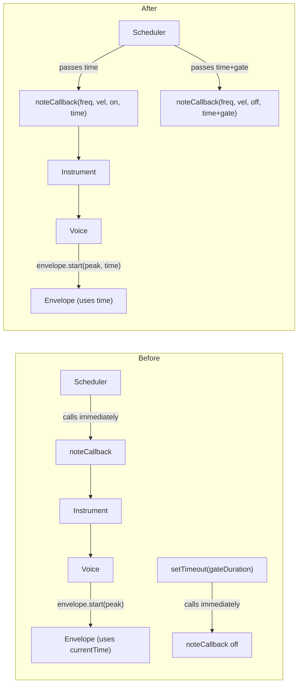

# Refactor Arpeggiator to Use Sample-Accurate Web Audio Scheduling

## Problem

The arpeggiator's `_scheduler` loop correctly uses the "lookahead" pattern (setTimeout + audioContext.currentTime), but the actual note triggering discards the precise `time`:

- **Note-on** fires immediately via `noteCallback(freq, velocity, true)` instead of at the scheduled `time`
- **Note-off (gate)** uses a second `setTimeout` instead of scheduling at `time + gateDuration`

This causes ~25ms jitter on note-on and additional jitter on note-off — very audible at fast rates (1/16 at 120 BPM = 125ms per note).

## Key Insight: Envelope Already Supports `time`

The existing [Envelope](src/instruments/synth/engine/envelope.js) class already accepts an optional `time` parameter on both `start(upperBoundMultiplier, time)` and `end(time)`, defaulting to `audioContext.currentTime` if omitted. This means the deepest layer is already prepared — we just need to thread `time` through the intermediate layers.

## Changes

### 1. Arpeggiator: pass `time` through callback, remove `setTimeout` for gate

In [arpeggiator.js](src/daw/engine/arpeggiator.js):

- Change `noteCallback` signature to `noteCallback(freq, velocity, isNoteOn, time)`
- In `_scheduleNote(time)`: pass `time` to the note-on callback call
- Replace the `setTimeout`-based gate note-off with a direct callback call using `time + gateDuration`
- Remove `currentlyPlayingNote` tracking (no longer needed since note-off is pre-scheduled)

```javascript
_scheduleNote: function( time ) {
    // ... existing note selection, velocity, duration logic ...

    noteCallback( freq, velocity, true, time );
    noteCallback( freq, 0, false, time + gateDuration );
}
```

### 2. DAW: forward `time` in the arpeggiator callback

In [daw.js](src/daw/daw.js) `_setupArpeggiatorCallback`:

- Accept `time` from the arpeggiator callback
- Pass it through to `instrument.onMidiMessage` in the `parsed` object as a new `time` field

### 3. Instrument: forward `time` to voice

In [instrument.js](src/instruments/synth/instrument.js):

- `onMidiMessage` / `onNoteOn` / `onNoteOff`: accept and forward `time`

### 4. Voice: pass `time` to envelope start/end

In [voice.js](src/instruments/synth/engine/voice.js):

- `onMidiMessage`: extract `time` from `parsed` and pass to `onNoteOn` / `onNoteOff`
- `onNoteOn(noteFrequency, velocity, time)`: pass `time` to `gainEnvelope.start(attackPeak, time)` and `filterEnvelope.start(attackPeak, time)`
- `onNoteOff(noteFrequency, velocity, time)`: pass `time` to `gainEnvelope.end(time)` and `filterEnvelope.end(time)`

### 5. Arpeggiator `_stop`: schedule note-off at precise time

In `_stop()`, the cleanup note-off for the currently playing note should also use `audioContext.currentTime` rather than firing synchronously. Since we're moving to pre-scheduled note-offs, `_stop` needs to cancel any future scheduled events and send an immediate cleanup note-off at `audioContext.currentTime`.

## Data Flow (before vs after)



## What Does NOT Change

- The `_scheduler` setTimeout/lookahead loop — this is the correct pattern
- The `scheduleAheadTime` and `lookahead` constants
- The Envelope class internals (already supports `time`)
- Non-arpeggiator MIDI path (live keyboard playing continues to use `audioContext.currentTime` via the default)
